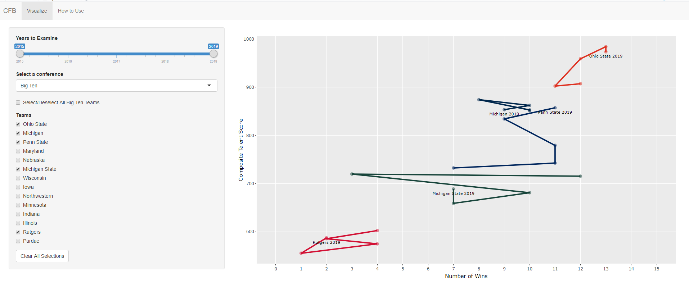

Hosted on shinyapps.io [here](https://njjms.shinyapps.io/CFBtracks/).

## How is roster talent related to wins in college football?

Unlike any other major sports league, college football relies almost entirely on recruiting high school age players.
There are numerous challenges that come with recruiting these young athletes, especially if you are a small school or a school with limited recent success.
Factors such as location, coaching staff, official visits, and recent bowl games all play a role in advertising schools for prospective recruits.
Regular season success captures the attention of many recruits, especially since the regular season is when many players build their resume for careers in the NFL.

This app helps us explore the relationship between regular season wins and recruiting success for different teams over the past few years.

The metric for recruiting success is the *Talent Composite Score* taken from [247Sports](https://247sports.com/Season/2019-Football/CollegeTeamTalentComposite/).
The score is one number describing a team's entire roster at the beginning of the season.
It takes into account the indivudal ratings of the players from a variety of recruiting websites and journals.

## Usage

We can select teams to include in our plot by picking from the conference dropdown and using the checkboxes.
There is also an option within every conference to select all teams at once.

We can also display multiple teams from multiple conferences at the simulataneously.

We can also select a year range to display.
Picking only one year creates a scatterplot while selecting multiple years displays a talent-win trajectory.

Lastly, mousing over the points brings up a tooltip that includes the head coach (or coaches) for that team during that season.

Using this app, we can make visualizations like the one to the one below.

Here we can see that USC is in the top echelon of recruiting *despite* their lackluster recent seasons, indicating that they are such a big name that they are pretty much impervious to recruiting downturn.

Penn State is not far behind them and it appears that their recent success in 2016 has bumped them in recruiting.

Oregon State and Boise State are comparable in recruiting, despite Boise State having consistently more wins that Oregon State.
This suggests that simply being in a Power 5 conference like the Pac-12 boosts even rebuilding teams like the Beavers.

Lastly, we have Army who despite their recent successes are towards the bottom of the recruiting heirarchy.
This is likely a by-product of Army having a rigorous selection process - it takes more than being good at football to get recruited by West Point!

